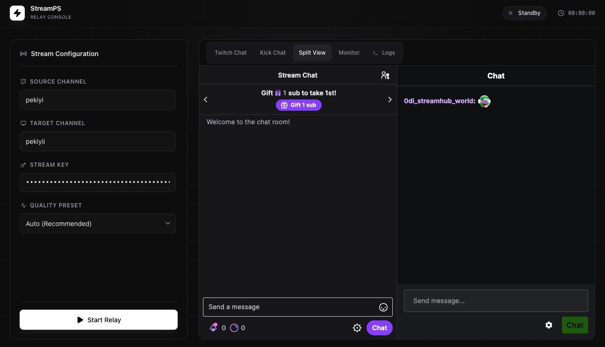

<div align="center">



<h1>StreamPS</h1>

<p>Relay your Twitch stream to Kick in real time — no encoding, no quality loss.</p>

[](https://github.com/eonurk/StreamPS/releases/latest)
[](https://github.com/eonurk/StreamPS/releases/latest)
[](LICENSE)
[](https://ko-fi.com/onurr)

</div>

---

## What is StreamPS?

PS5, Xbox, and console players can stream to Twitch natively — but not to Kick. StreamPS bridges that gap by relaying your live Twitch stream to Kick automatically, with zero re-encoding and no quality loss.

**One click. Both platforms. Same stream.**

## Features

- **Zero re-encoding** — streams are copied bit-for-bit, so quality and CPU load are unchanged
- **Auto RTMP detection** — detects the correct Kick server from your stream key prefix (US East, US West, EU)
- **Live stats** — real-time FPS, bitrate, and encoding speed in the header
- **Unified chat** — Twitch and Kick chat merged into a single feed, side-by-side, or separate tabs
- **Terminal logs** — raw FFmpeg output for debugging connection issues
- **System tray** — close the window without stopping the relay; it keeps running in the background
- **Stream title updater** — update your Kick stream title from within the app
- **Quality presets** — Auto, Source, 720p60, 720p, 480p

## Download

| Platform | Download |
|----------|----------|
| macOS (Apple Silicon) | [StreamPS-0.2.0-arm64.dmg](https://github.com/eonurk/StreamPS/releases/latest/download/StreamPS-0.2.0-arm64.dmg) |
| Windows | [StreamPS-Setup-0.1.0.exe](https://github.com/eonurk/StreamPS/releases/latest/download/StreamPS-Setup-0.1.0.exe) |
| Linux | [StreamPS-0.1.0.AppImage](https://github.com/eonurk/StreamPS/releases/latest/download/StreamPS-0.1.0.AppImage) |

> **macOS note:** The app is unsigned. On first launch right-click → Open → Open to bypass Gatekeeper.

## Requirements

- **FFmpeg** must be on your system PATH (or bundled in the app for packaged builds)
- A live Twitch stream from your PS5, Xbox, or OBS
- A Kick stream key (Settings → Stream Key on kick.com)

## Quick Start

1. Go live on Twitch from your PS5, Xbox, or OBS
2. Open StreamPS
3. Enter your **Twitch username** (source)
4. Enter your **Kick username** and **Stream Key**
5. Click **Start Relay**

> Wait 1–2 minutes after starting your Twitch stream before hitting Start Relay to ensure HLS segments are available.

## Running from Source

```bash
git clone https://github.com/eonurk/StreamPS.git
cd StreamPS
npm install
npm run electron:dev
```

To build the packaged app:

```bash
npm run electron:build
```

## Support

If StreamPS saves you time, consider buying me a coffee ☕

[](https://ko-fi.com/onurr)

## License

MIT
